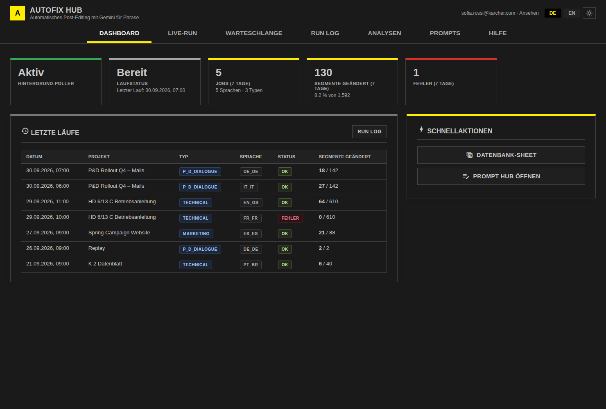

# AutoFix Hub

Automatisches Post-Editing mit Gemini für Phrase (Google Apps Script).
AutoFix findet Projekte mit gesetztem AutoFix-Custom-Field, post-editiert die Jobs im Workflow-Schritt „PE Gemini“ mit dem Prompt des jeweiligen Dokumenttyps und schreibt die Korrekturen zurück nach Phrase.
Oberfläche und Bedienung entsprechen dem [Prompt Hub](https://github.com/MMario996/Prompt-hub) bzw. Kärcher Translation Services.


## Oberfläche

| Bereich | Inhalt | Rolle |
|---|---|---|
| **Dashboard** | Poller-Status (starten 5/10/30 Min., stoppen), Laufstatus, Kennzahlen der letzten 7 Tage, letzte Läufe, Schnellaktionen | Ansehen (Steuern: Ausführen) |
| **Live-Run** | Lauf starten, Fortschritt live (Projekte, Jobs, geänderte Segmente, Fehler), Konsole | Ausführen |
| **Warteschlange** | Projekte mit AutoFix-Flag und Jobs im Schritt „PE Gemini“ | Ansehen |
| **Run Log** | Suche und Filter, Korrekturen als Wort-Diff, Fehlermeldungen, Re-Push nach Phrase | Ansehen (Re-Push: Ausführen) |
| **Analysen** | MQM-Report (mit Sheet-Export), Benchmark je Sprache, Term-Drift, Glossar-Vorschläge | Ausführen (rufen Gemini auf) |
| **Prompts** | Was AutoFix je Dokumenttyp gerade verwendet, Herkunft (Prompt Hub / Fallback), wirksame Gemini-Werte, Link zum Bearbeiten im Prompt Hub | Ansehen |
| **Admin** | Anträge freigeben, Nutzer und Rollen, Admins, AutoFix-Einstellungen, Konfiguration, Wartung (Run-Sperre, Cache, Projektsuche), Audit-Log | Admin |
| **Hilfe** | FAQ | alle |

Dazu: Deutsch/Englisch, Dark Mode, mobil nutzbar, Zugriffsantrag direkt in der App (Benachrichtigung per E-Mail oder Google Chat).

## Rollen und Zugriff

| Rolle | Darf |
|---|---|
| Admin | alles |
| Ausführen (operator) | zusätzlich zu „Ansehen“: Läufe starten, Poller steuern, Re-Push, Analysen |
| Ansehen (viewer) | Dashboard, Warteschlange, Run Log, Prompts |

- Gespeichert in der Script Property `AUTOFIX_HUB_ACCESS`.
- Admins werden beim ersten Start aus dem alten Prompt Editor (`PROMPT_EDITOR_ADMINS`) übernommen. Gibt es dort keine, einmal `bootstrapAutoFixAdmin()` im Editor ausführen oder in der App den ersten Admin eintragen.
- **Offener Modus:** Solange kein Admin existiert, darf jeder in der Domain alles, wie bisher. Die App zeigt dann einen Hinweis.
- Die Rollen gelten auch, wenn jemand die bestehenden Funktionen direkt aufruft, zum Beispiel über `google.script.run`. Geschützt sind `runNow`, `runAutoFixForProject`, `replayChangesForJob`, `setupAutoFixTrigger`, `removeAutoFixTrigger`, `forceUnlock` und `recreateDatabase`.
- Zeitgesteuerte Läufe (`autoFixPoller`) sind nicht betroffen.

## Aufbau

| Pfad | Inhalt |
|---|---|
| `Code.gs`, `Database.gs`, `Settings.gs` | AutoFix-Logik (Läufe, Run Log, Einstellungen); nur um die Rollenprüfung ergänzt |
| `PromptEditorAccess.gs`, `PromptEditor.html` | alter Prompt Editor (`?page=prompts`); liest zusätzlich die Spaces aus dem Prompt Hub |
| `HubAccess.gs` | Rollen, Anträge, Konfiguration der Oberfläche |
| `HubApi.gs` | alle Funktionen, die die Oberfläche aufruft, jede mit Rollenprüfung |
| `ui/` | Quelle der Oberfläche (`shell.html`, `app.css`, `i18n.js`, `app.js`) |
| `Index.html` | **generiert** aus `ui/` mit `npm run build`, nicht von Hand ändern |
| `tools/` | Index-Generator, Vorschau mit Beispieldaten, Mockups |

**Einstellungen speichern:** Die neue Oberfläche schreibt nur die geänderten Zeilen im Tab „Settings“.
Die alte Oberfläche rief `saveAutoFixSettings()` mit 7 Werten auf. Das leert den Tab und löscht dabei alle Prompts (`peInstructions_*`) und sonstigen Werte.

**Ohne Wirkung:** `tmThreshold` und `pollerIntervalMinutes` liest der aktuelle Code nicht.
Den Poller-Takt legt der Start-Knopf fest. Die Oberfläche kennzeichnet beide Werte entsprechend.

## Entwicklung

```bash
npm ci
npm run build       # Index.html aus ui/ erzeugen
npm test            # Rollen, Schutz, Settings, Anträge, Konsistenz
npm run test:ui     # Browser-Tests der echten Oberfläche
npm run lint
npm run preview     # preview/admin.html: klickbare Vorschau mit Beispieldaten
npm run mockups     # docs/mockups/*.png
```

## CI/CD

Aufbau wie im Prompt Hub:
- **`ci.yml`:** Lint + generierte Dateien, Logik-Tests (Node 20/22), Browser-Tests, Mockups als Artefakt, gitleaks + npm audit.
- **`deploy.yml`:** Push auf `main` geht auf Staging, Tag `v*.*.*` auf Produktion (nach Freigabe). Beides per `clasp push` + `clasp deploy`.
- **Secrets:** `CLASPRC_JSON`, `STAGING_SCRIPT_ID`, `STAGING_DEPLOYMENT_ID`, `PROD_SCRIPT_ID`, `PROD_DEPLOYMENT_ID`. Fehlen sie, wird übersprungen.

`clasp` lädt alle `.gs`/`.html`-Dateien außer `Doget patch.gs`. Das ist eine Kopiervorlage mit einem zweiten `doGet()` und gehört nicht ins Projekt.

## Mockups

| | |
|---|---|
|  Dashboard |  Live-Run |
|  Warteschlange |  Run Log mit Diff |
|  Re-Push |  MQM-Report |
|  Term-Drift |  Prompts |
|  Admin |  Kein Zugriff |
|  Dark Mode (Ansehen) |  Mobil |
