# AutoFix Hub

Automatisches Post-Editing mit Gemini für Phrase (Google Apps Script).
AutoFix findet Projekte mit gesetztem AutoFix-Custom-Field, post-editiert die Jobs im Workflow-Schritt „PE Gemini“ mit dem Prompt des jeweiligen Dokumenttyps und schreibt die Korrekturen zurück nach Phrase.
**AutoFix Hub ist das Werkzeug der Admins.** Prompts, Styleguides und Kontext-Dateien pflegen alle im [Prompt Hub](https://github.com/MMario996/Prompt-hub).
Oberfläche und Bedienung entsprechen Prompt Hub, Terminologie-Hub und Kärcher Translation Services; die App ist in Google Sites eingebettet (kein Logo, keine Icons).

> 📚 **Dokumentation:** Fachliche Doku, Datenbanken, Abläufe in [`docs/DOKUMENTATION.md`](docs/DOKUMENTATION.md) · alle Phrase- und sonstigen Endpunkte in [`docs/ENDPOINTS.md`](docs/ENDPOINTS.md) · CI/CD in [`docs/CI-CD.md`](docs/CI-CD.md) · Gesamtübersicht aller zehn Kärcher-Translation-Repositories mit Systemlandkarte: [`kaerchertranslationservices/docs/gesamt`](https://github.com/MMario996/kaerchertranslationservices/tree/main/docs/gesamt).

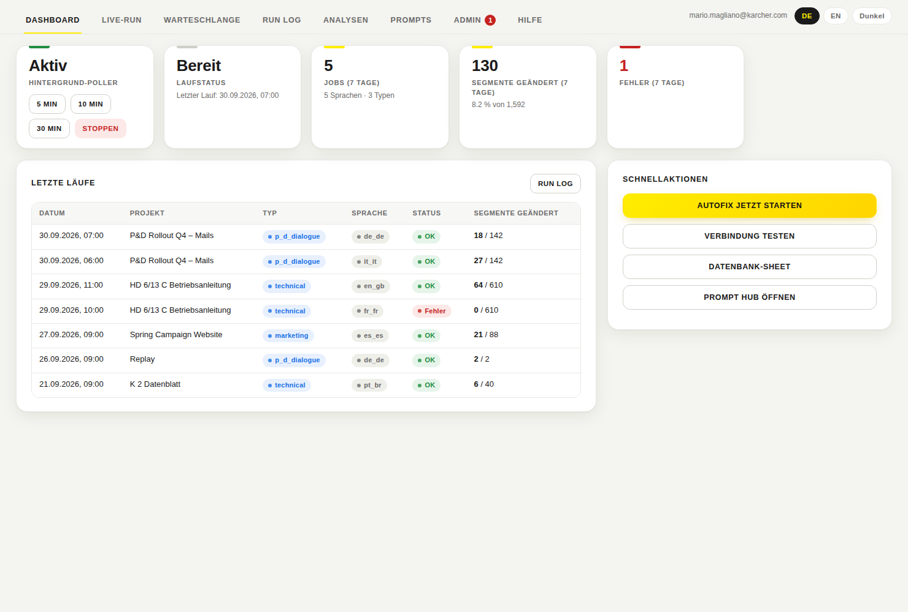

## Oberfläche

| Bereich | Inhalt |
|---|---|
| **Dashboard** | Poller-Status (starten 5/10/30 Min., stoppen), Laufstatus, Kennzahlen der letzten 7 Tage, letzte Läufe, Schnellaktionen |
| **Live-Run** | Lauf starten, Fortschritt live (Projekte, Jobs, geänderte Segmente, Fehler), Konsole |
| **Warteschlange** | Projekte mit AutoFix-Flag und Jobs im Schritt „PE Gemini“ |
| **Run Log** | Suche und Filter, Korrekturen als Wort-Diff, Fehlermeldungen, Re-Push nach Phrase |
| **Analysen** | MQM-Report (mit Sheet-Export), Benchmark je Sprache, Term-Drift, Glossar-Vorschläge |
| **Prompts** | Was AutoFix je Dokumenttyp gerade verwendet, Herkunft (Prompt Hub / Fallback), wirksame Gemini-Werte, Link zum Bearbeiten im Prompt Hub |
| **Admin** | Anträge auf Admin-Zugang, Admins, AutoFix-Einstellungen, Konfiguration, Wartung (Run-Sperre, Cache, Projektsuche), Audit-Log |
| **Hilfe** | FAQ, ausgelieferte Version |

Dazu: Deutsch/Englisch, Dark Mode, mobil nutzbar.

## Zugriff: nur Admins

- Zugriff hat nur, wer in der Script Property `AUTOFIX_HUB_ACCESS` als Admin steht. Die früheren Rollen „Ansehen“ und „Ausführen“ gelten nicht mehr; alte Einträge bleiben gespeichert, werden aber ignoriert.
- Wer keinen Zugriff hat, sieht einen Hinweis mit Link zum Prompt Hub und kann Admin-Zugang beantragen (Benachrichtigung per E-Mail oder Google Chat). Die Freigabe macht den Antragsteller zum Admin.
- Admins werden beim ersten Start aus dem alten Prompt Editor (`PROMPT_EDITOR_ADMINS`) übernommen. Gibt es dort keine, einmal `bootstrapAutoFixAdmin()` im Editor ausführen oder in der App den ersten Admin eintragen.
- **Offener Modus:** Solange kein Admin existiert, darf jeder in der Domain alles, wie bisher. Die App zeigt dann einen Hinweis.
- Der Schutz gilt auch, wenn jemand die bestehenden Funktionen direkt aufruft, zum Beispiel über `google.script.run`. Geschützt sind `runNow`, `runAutoFixForProject`, `replayChangesForJob`, `setupAutoFixTrigger`, `removeAutoFixTrigger`, `forceUnlock` und `recreateDatabase`.
- Zeitgesteuerte Läufe (`autoFixPoller`) sind nicht betroffen.

## Styleguides im Prompt Editor

Ein **Prompt** sagt, *was* Gemini tun soll (Aufgabe, Regeln, Nomenklatur des Dokumenttyps). Ein **Styleguide** sagt, *wie* das Ergebnis klingen und aussehen soll (Anrede, Tonalität, Schreibweisen) und gilt für beliebig viele Prompt Spaces.

- Reiter **Styleguides** im Prompt Editor: anlegen (Text oder `.md`-Datei), bearbeiten, löschen, Prompt Spaces zuordnen. Anlegen darf jeder freigeschaltete Nutzer, ändern und löschen nur, wer ihn angelegt hat, oder ein Admin. Zuordnen darf man nur zu Spaces, die man bearbeiten darf; Admins können „alle Prompt Spaces“ wählen.
- In jeder Prompt-Karte zeigt der Bereich **Styleguides**, was für den Space gilt, und lässt die Zuordnung direkt ändern.
- Gespeichert im Datenbank-Sheet, Tab „Styleguides“. Der Prompt-Text (`peInstructions_<type>`) bleibt unverändert: `buildPePrompt_` hängt die zugeordneten Styleguides beim Bauen des Prompts als `=== STYLEGUIDE: <Name> ===` hinter die PE-Anweisungen. Das gilt für jeden Lauf und für „Prompt testen“. Fehler beim Lesen des Tabs brechen keinen Lauf ab.


| Pfad | Inhalt |
|---|---|
| `src/Code.gs`, `src/Database.gs`, `src/Settings.gs` | AutoFix-Logik (Läufe, Run Log, Einstellungen); nur um die Rollenprüfung ergänzt |
| `src/PromptEditorAccess.gs`, `src/PromptEditor.html` | alter Prompt Editor (`?page=prompts`); liest zusätzlich die Spaces aus dem Prompt Hub |
| `src/HubAccess.gs` | Zugriff (nur Admins), Anträge, Konfiguration der Oberfläche |
| `src/HubApi.gs` | alle Funktionen, die die Oberfläche aufruft, jede mit Prüfung |
| `src/HubVersion.gs` | Versionsanzeige unter „Hilfe“; die Pipeline stempelt Tag und Commit beim Deploy |
| `ui/` | Quelle der Oberfläche (`shell.html`, `base.css` = gemeinsames Design mit dem Prompt Hub, `app.css`, `i18n.js`, `app.js`) |
| `src/Index.html` | **generiert** aus `ui/` mit `npm run build`, nicht von Hand ändern |
| `tools/` | Index-Generator, Vorschau mit Beispieldaten, Mockups, Kodierungs- und Design-Wächter, Versionsstempel |

**Einstellungen speichern:** Die neue Oberfläche schreibt nur die geänderten Zeilen im Tab „Settings“.
Die alte Oberfläche rief `saveAutoFixSettings()` mit 7 Werten auf. Das leert den Tab und löscht dabei alle Prompts (`peInstructions_*`) und sonstigen Werte.

**Ohne Wirkung:** `tmThreshold` und `pollerIntervalMinutes` liest der aktuelle Code nicht.
Den Poller-Takt legt der Start-Knopf fest. Die Oberfläche kennzeichnet beide Werte entsprechend.

## Entwicklung

```bash
npm ci
npm run build       # Index.html aus ui/ erzeugen
npm test            # nur Admins, Schutz, Settings, Anträge, Konsistenz
npm run check       # Index.html aktuell, Zeichenkodierung, Design
npm run test:ui     # Browser-Tests der echten Oberfläche
npm run lint
npm run preview     # preview/admin.html: klickbare Vorschau mit Beispieldaten
npm run mockups     # docs/mockups/*.png
```

## CI/CD

Gleiche Pipeline wie im Prompt Hub, ausführlich in [docs/CI-CD.md](docs/CI-CD.md).

| Workflow | Wann | Was |
|---|---|---|
| `ci.yml` | jeder PR, nachts, vor jedem Deploy | Lint, `src/Index.html` aktuell, Zeichenkodierung (keine neuen kaputten Umlaute), Design-Wächter, Logik-Tests (Node 20/22), Browser-Tests, Mockups und klickbare Vorschau als Artefakt, gitleaks + npm audit, Design-Abgleich mit dem Prompt Hub, Zusammenfassung |
| `deploy.yml` | Push auf `main` → **Staging**; Tag `v*.*.*` → **Produktion** (nach Freigabe) | CI komplett, Version stempeln, `clasp push` + `clasp deploy`, Gegenprobe, bei Tags GitHub-Release |
| Dependabot | wöchentlich | npm und GitHub Actions |

**Secrets:** `CLASPRC_JSON`, `STAGING_SCRIPT_ID`, `STAGING_DEPLOYMENT_ID`, `PROD_SCRIPT_ID`, `PROD_DEPLOYMENT_ID`, `PROMPT_HUB_REPO_TOKEN` (Lesezugriff auf `MMario996/Prompt-hub`). Fehlen sie, wird übersprungen.

**Bekannte Altlast:** In `src/Code.gs`, `src/Settings.gs`, `src/Database.gs`, `src/PromptEditorAccess.gs` und `src/PromptEditor.html` sind durch einen früheren Rück-Sync an 285 Stellen Umlaute durch `?` ersetzt, auch im Prompt-Rahmen für Gemini. Der Kodierungs-Wächter lässt keine neuen zu; Details in [docs/CI-CD.md](docs/CI-CD.md).

`clasp` lädt alle `.gs`/`.html`-Dateien außer `Doget patch.gs`. Das ist eine Kopiervorlage mit einem zweiten `doGet()` und gehört nicht ins Projekt.

## Mockups

| | |
|---|---|
|  Dashboard | 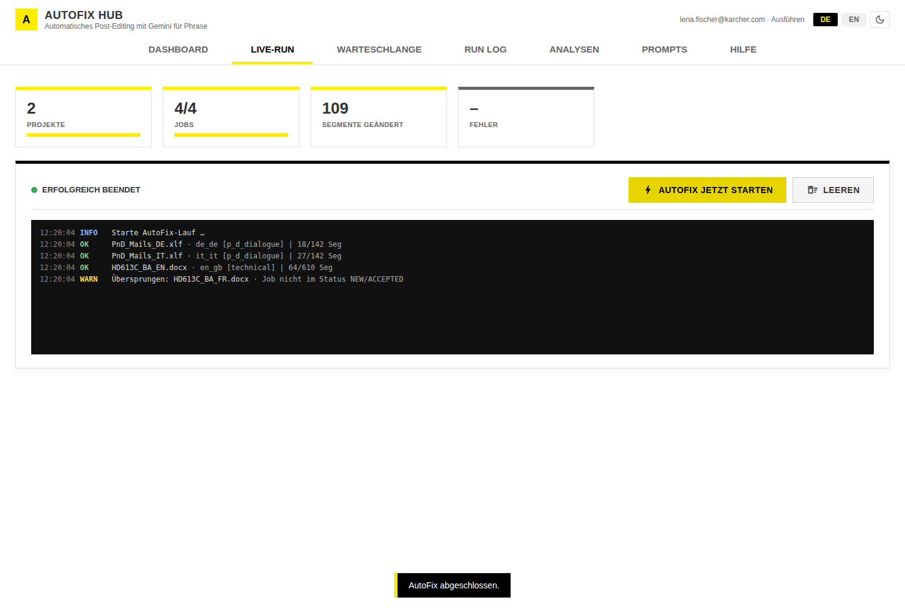 Live-Run |
| 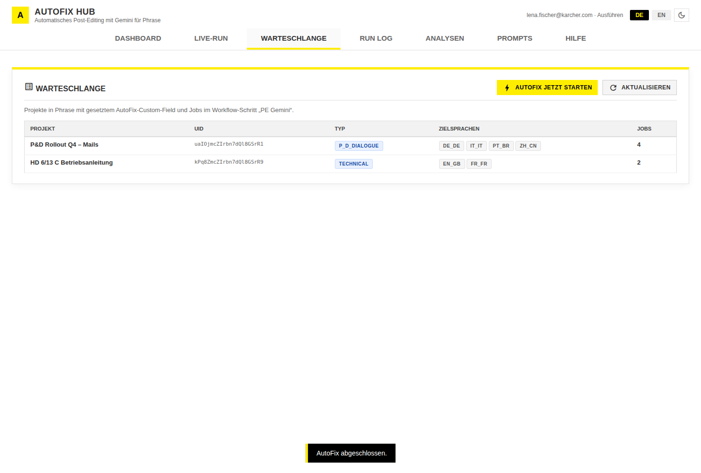 Warteschlange | 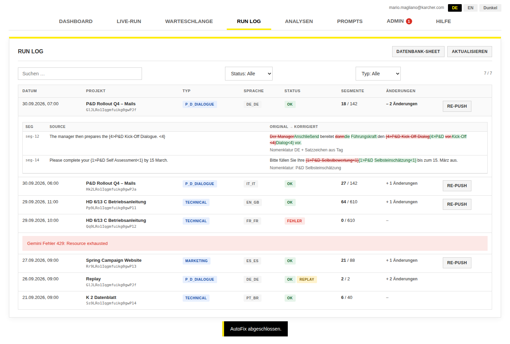 Run Log mit Diff |
| 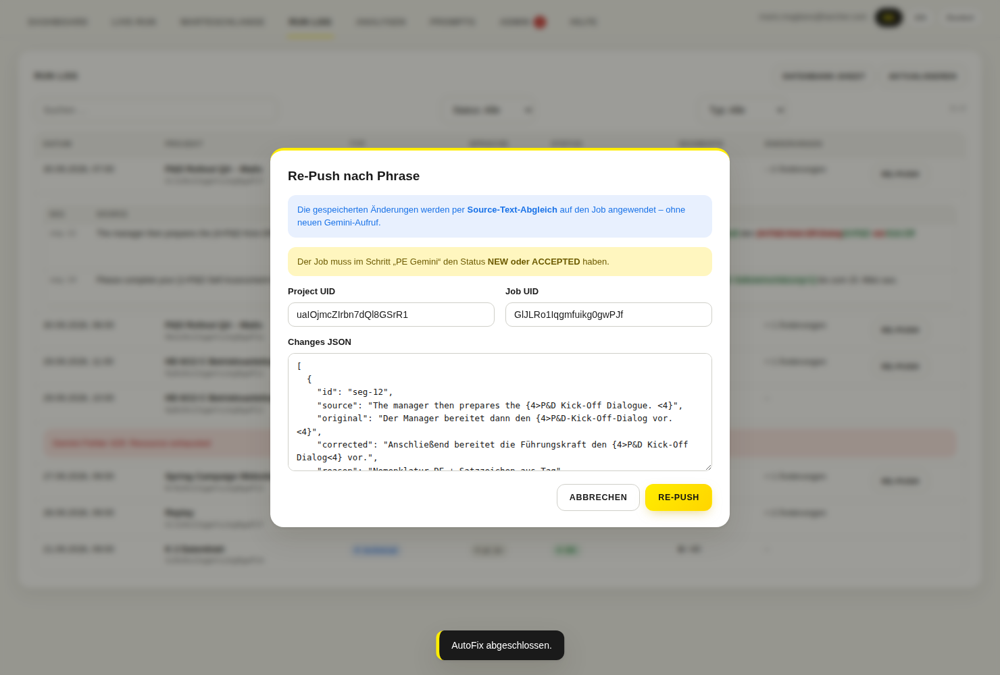 Re-Push | 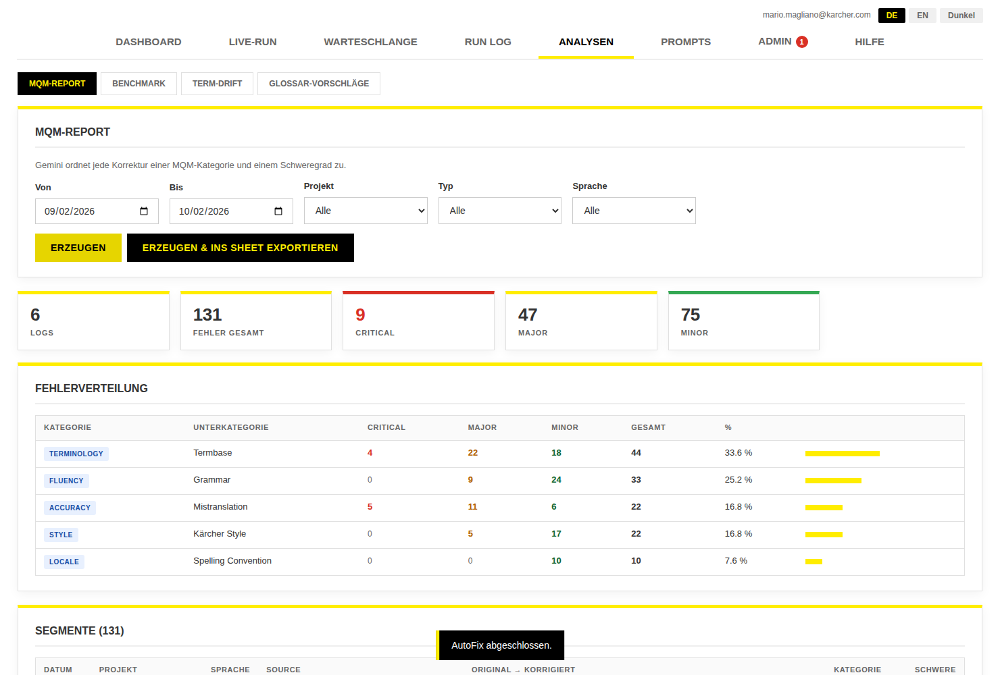 MQM-Report |
| 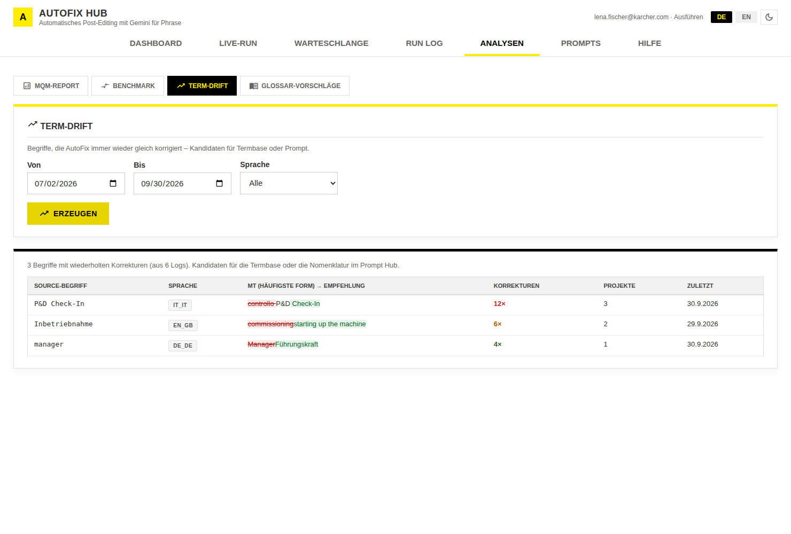 Term-Drift | 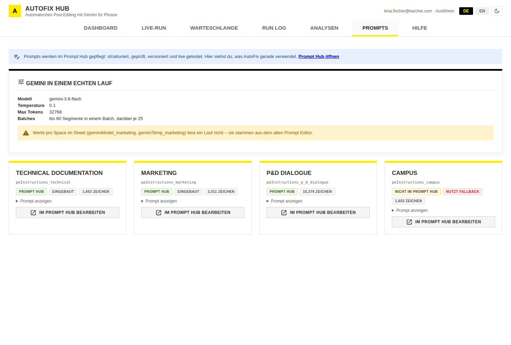 Prompts |
| 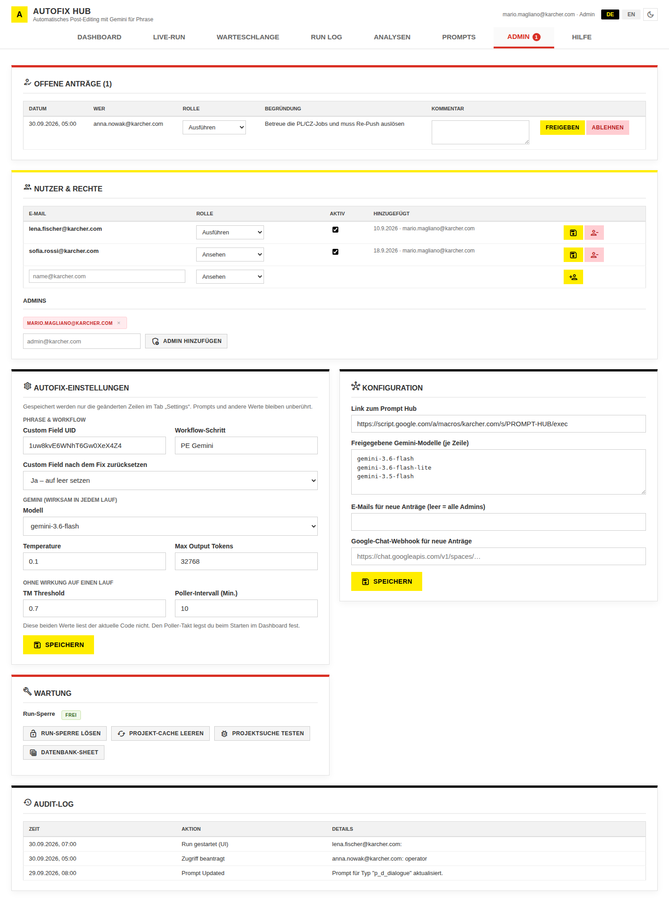 Admin | 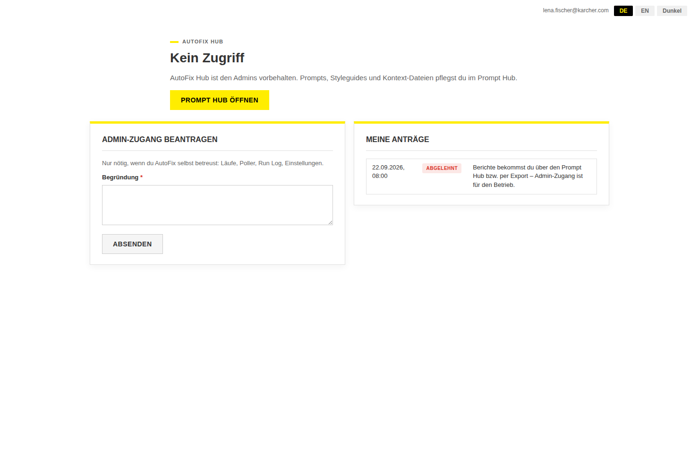 Kein Zugriff (Hinweis auf den Prompt Hub) |
| 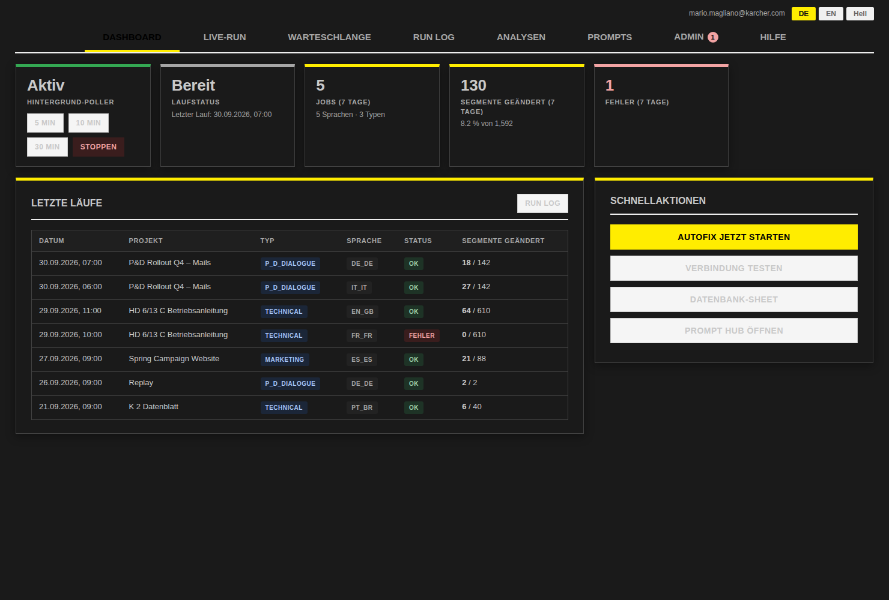 Dark Mode | 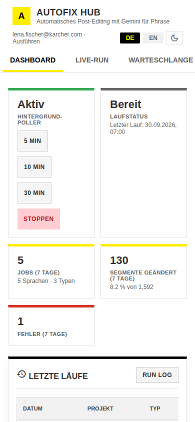 Mobil |

## Repository-Standard

Alle Kärcher-Translation-Repositories sind gleich aufgebaut (Vorbild: Prompt Hub); `tools/check-structure.js` prüft das in der CI.

| Pfad | Inhalt |
|---|---|
| `src/` | Apps-Script-Code inkl. `appsscript.json` (clasp `rootDir`) |
| `tests/` | Node-Tests, Einstieg `tests/run-all.js`; `gas.syntax.test.js` prüft Syntax, Manifest und doppelte Namen |
| `tools/` | `check-structure.js`, `check-encoding.js`, Build-Skripte |
| `docs/` | `DOKUMENTATION.md`, `ENDPOINTS.md`, `CI-CD.md` |
| `.github/` | `ci.yml`, `deploy.yml`, `actions/clasp-deploy`, Dependabot, CODEOWNERS, PR-Vorlage |

```bash
npm ci
npm test        # Logik-Tests
npm run lint    # ESLint
npm run check   # Struktur, Zeichenkodierung, generierte Dateien
npm run ci      # alles zusammen
```

Lokal deployen: `.clasp.json` mit `{"scriptId":"…","rootDir":"src"}`, dann `clasp push`.
